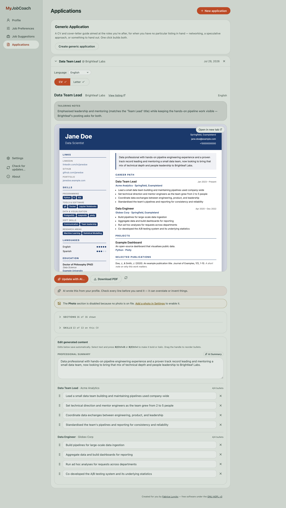
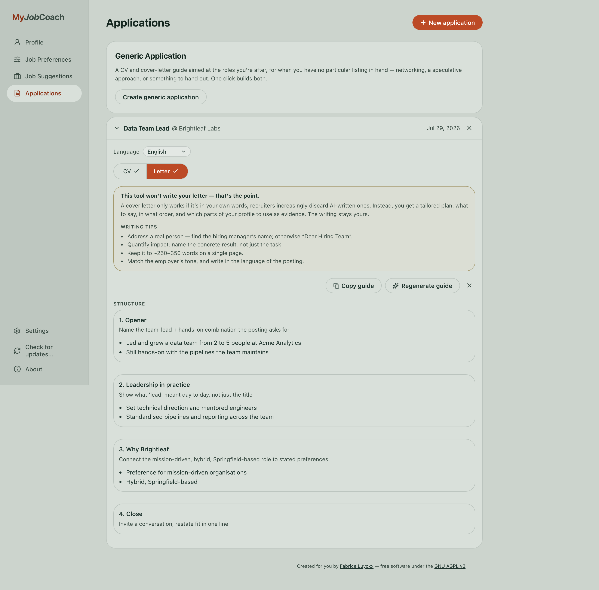
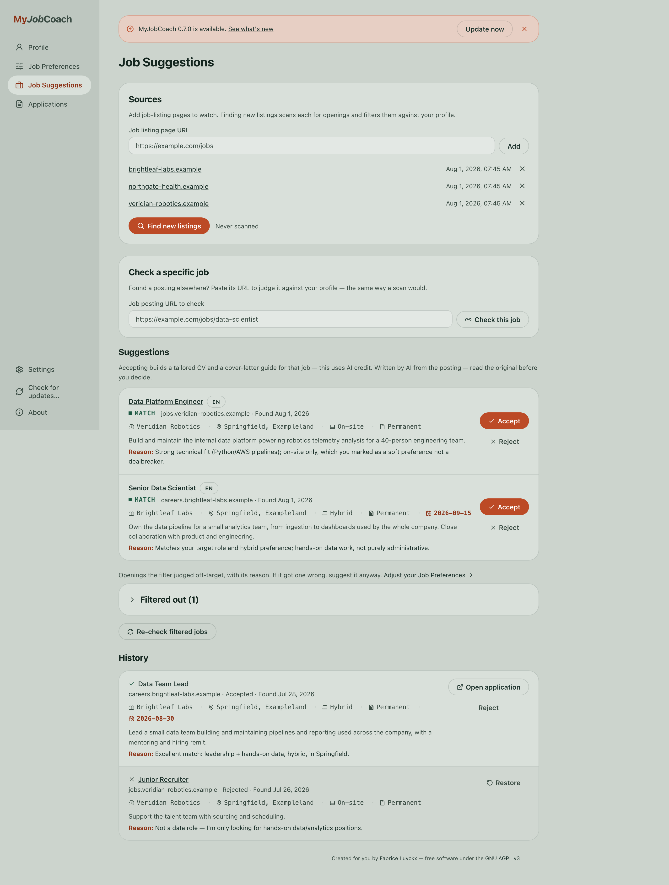
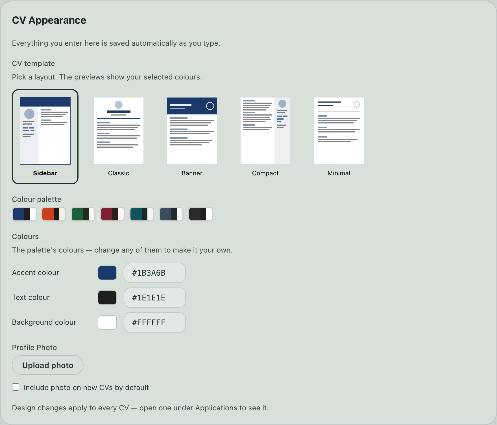

# MyJobCoach

**Your career profile, tailored into a new CV for every job you apply to — automatically.**

[](LICENSE)
[](../../)

MyJobCoach is a free, open-source, local-first career assistant. Enter your career
details once; it tailors a fresh CV and a cover-letter writing guide for every job
you apply to, and can watch job boards for openings that actually fit you. No
account, no subscription, no ads — and no company reading your job search over your
shoulder, because your data never leaves your own computer unless you choose an AI
provider that needs it to.

*(Screenshots below use a fictional sample profile — "Jane Doe" — not real data.)*

<table>
<tr>
<td width="50%">

**AI-tailored CV, editable in place**


</td>
<td width="50%">

**A writing guide, not a fake AI letter**


</td>
</tr>
<tr>
<td width="50%">

**Job Suggestions, filtered against your preferences**


</td>
<td width="50%">

**Five CV layouts, any colour palette**


</td>
</tr>
</table>

---

## Why MyJobCoach

- **One profile, endless tailored CVs.** Fill in your career details once — jobs,
  skills, education, the rest — and every CV is generated fresh from it, rewritten
  to match a specific opening's language and priorities. No refilling a form per
  application, no separate documents to keep in sync.
- **Finds jobs for you.** Point it at the job-listing pages you care about and it
  scans them for new openings, reads each one in full, and only surfaces the ones
  that actually match your preferences — title, location, remote/on-site,
  dealbreakers, all of it. It **learns from what you accept and reject**, so the
  suggestions get sharper the more you use it.
- **Cover-letter guides, not fake AI letters.** Instead of generating a generic
  letter no recruiter wants to read, it gives you a writing skeleton — which points
  to make, and which real facts from your profile back each one up. You still write
  it, in your own voice.
- **Run the AI your way.** Bring your own API key (OpenRouter, Anthropic, OpenAI,
  Google Gemini, or any OpenAI-compatible server) for the best results, or download
  a free local model and run everything on your own machine with no account and no
  per-generation cost. Your choice, switchable any time.
- **Genuinely local and private.** Your profile, generated CVs, and job history live
  in a folder on your own computer — never on a server of ours, because there isn't
  one. Move to a new machine with one **Export backup** / **Restore backup**, no
  cloud account required.
- **Start from a CV you already have.** Upload an existing PDF and the AI extracts
  your details into a starting profile you review and edit, instead of typing
  everything from scratch.
- **Speaks your language.** The whole interface is translated (English, Dutch,
  French, German, Spanish, Italian, Portuguese, Polish out of the box, more
  generated on demand), and every CV is written in whatever language the job
  posting — or you — asks for.
- **Free and open source, for real.** AGPL-3.0, no commercial angle, no telemetry.
  Read the code, self-host it, change it.
- **Built to grow with you.** The project is planned with [OpenSpec](https://github.com/Fission-AI/OpenSpec) —
  every non-trivial change starts as a written proposal — which makes it
  straightforward for anyone to read *why* something works the way it does, or
  propose and build a new feature themselves.

---

## Get started (no coding required)

Grab the latest build for your OS from the [Releases](../../releases) page:

- **macOS** — download the `.dmg` (Apple Silicon or Intel — see the release notes
  for which one), open it, drag **MyJobCoach** into Applications, and launch it.
- **Windows** — download the `.zip`, **extract the whole folder** (not just the
  `.exe`), then run `MyJobCoach.exe` from inside it.
- **Linux** — download the `.tar.gz`, extract it, and run `MyJobCoach/MyJobCoach`.

The app opens in its own window, no browser tab needed. Because the builds aren't
code-signed yet, macOS and Windows will show a one-time security warning on first
launch — click through it (**System Settings → Privacy & Security → Open Anyway**
on macOS, **More info → Run anyway** on Windows). It also downloads a small PDF
engine on first launch.

Then choose how the AI runs, in **Settings → AI Engine**:

- **Free & local** — download a model (2.5–5 GB) that runs entirely on your own
  machine. No account, no cost, fully offline.
- **Your own API key** — best quality, pay a few cents per CV. Any of OpenRouter,
  Anthropic, OpenAI, Google Gemini, or a custom OpenAI-compatible server (e.g.
  Ollama running locally).

All your data lives in a normal per-user folder (`~/Library/Application
Support/MyJobCoach` on macOS, `%APPDATA%\MyJobCoach` on Windows,
`~/.local/share/MyJobCoach` on Linux) and the app keeps itself updated — a banner
appears when a new version is available, and updating never touches your data.
Moving to a new computer is one file: **Settings → Backup & Restore**.

---

## For developers

### Requirements

- [uv](https://docs.astral.sh/uv/) (installs Python 3.11+ for you)
- Node.js 18+

### Setup & run

```bash
git clone git@github.com:FabriceLuyckx/job-coach.git
cd job-coach
./setup.sh              # macOS: installs deps, seeds config.json (profile stays empty)

# Terminal 1
uv run uvicorn app.main:app --reload

# Terminal 2
cd frontend && npm run dev
```

Open **http://localhost:5173**. On first run, a banner points you to **Settings →
AI Engine** to configure a local model or an API key.

Not on macOS, or want the manual steps `setup.sh` runs?

```bash
uv sync                              # backend deps
uv run playwright install chromium   # headless browser, needed for PDF export
cd frontend && npm install && cd ..
cp config.json.example config.json
```

`profile/profile.json` and `config.json` are gitignored (personal data + API keys).
Want the local free AI engine in dev too? `uv sync --extra local` (heavy,
platform-specific — off by default).

To see a brand-new user's empty state instead of your own dev data:

```bash
MYJOBCOACH_DATA_DIR=$(mktemp -d) uv run uvicorn app.main:app --reload
```

### CLI scripts

For scripting outside the web UI:

```bash
uv run python scripts/generate_cv.py --lang nl --job "Company Role"   # profile → HTML CV, no AI
uv run python scripts/tailor_cv.py --url https://example.com/jobs/123 # AI-tailored CV from a posting
uv run python scripts/scan_debug.py --url https://example.com/jobs    # test the job-scanner on one page
```

### Tests

```bash
uv run pytest                       # backend: hardening, schema migration, scanner, engines, i18n…
node frontend/scripts/check-tags.mjs  # tag-input parsing
node scripts/check_contrast.mjs       # WCAG contrast on the app-shell colour tokens
```

### Building a release

Desktop builds use [PyInstaller](https://pyinstaller.org)
(`packaging/myjobcoach.spec`); Chromium downloads on the user's first launch to
keep the installer small.

```bash
cd frontend && npm run build && cd ..
uv sync --extra package
uv run pyinstaller packaging/myjobcoach.spec
```

Releases are automated: merge `main` → `stable` and
[release-please](https://github.com/googleapis/release-please) computes the
version bump from your [Conventional Commits](https://www.conventionalcommits.org)
subjects, opens a release PR, tags it, and CI attaches the macOS/Windows/Linux
builds — see `CLAUDE.md` for the full chain.

### Contributing / architecture

Full architecture, phase-by-phase feature history, data schemas, and every design
decision live in [`CLAUDE.md`](CLAUDE.md) — start there. Non-trivial changes are
planned with [OpenSpec](https://github.com/Fission-AI/OpenSpec)
(`npm install -g @fission-ai/openspec`): `/opsx:propose` drafts a proposal, design
and task list, `/opsx:apply` implements it, `/opsx:archive` closes it out. Small,
obvious fixes don't need any of that — just open a PR.

---

## License

AGPL-3.0-or-later — see [LICENSE](LICENSE). If you run a modified version of this
app as a network service, the AGPL requires you to offer its source to your users.
